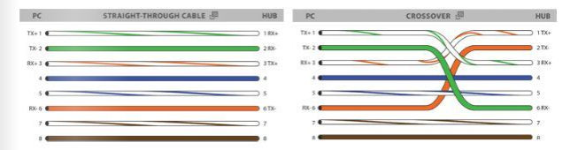

# Network 101 Notlar

### Network ve IP'lerin tanıtımı
1. İnternet genel olarak Ethernet kartlarının birbirleriyle iletişim kurmaları sayesinde çalışır.
2. Ethernet kartları Anakartlara entegre edilen donanım birimlerinden bisidir.
3. Ethernet kartları üzerinde bulundukları cihazların bir ağa bağlanmasını sağlar.
4. Bir Ethernet Port'undan diğerine uzanan kablo CAT6'dır.
5. CAT6'nın Ethernet Port'una giren başlığı RJ45'dir.
6. RJ45 başlığı, CAT6'dan gelen 8 adet bakır telin belli bir düzene göre sıralanmasını sağlayarak cihazlardaki Ethernet portlarına kilitlenerek CAT6 ya da herhangi bir Ethernet kablosunun bağlanmasını sağlar.
7. Ethernet kabloları, UTP ve STP olarak ikiye ayrılır.
8. STP, korumalı yani topraklamalı olan kablodur.
9. STP, ikişerli olarak birbirlerine bakır tellerin aralarında bir plastik çubuğun kablo boyunca uzanması anlamına gelir. Bu parça tellerin zarar görmesini engeller ve tellerin dalga boylarının düşmesini UTP'ye göre daha uzun süre engeller.
10. CAT6, STP tipinde bir kablodur.
11. Ethernet kablolarındaki bakır teller RJ45 başlığı sayesinde "Straigth Through(Düz)" ya da "Crossover Cable(Çapraz)" dizilimlerinde çakılabilirler.

12. Network'ler genel olarak Straight Through ile karşılaşırız çünkü Straigth Through birbirinden farklı Layer'larda çalışan cihazların iletişimini sağlamak kullanılır. Örneğin bir PC ile bir Switch aynı Layer'da cihazlar değillerdir.
13. İstisnai bir durum olarak PC direkt olarak Ethernet kablosu ile Router'ın Ethernet Port'una bağlanacak ise Crossover Cable çakılmalıdır.
14. Özetlenecek olursa özdeş iki cihaz Crossover Cable, farklı ise Straigth Through RJ45'e ihtiyaç var demektir.

---

### Network oluşturmak ve çalışma mantığı
1. Network, içerisinde bir ya da birden fazla Client bulunduran ve bu Client ile iletişime geçilmesinin sağlandığı ortamdır.
2. İki tane Client'in birbiri ile iletişime geçebilmesi için birinin Ethernet Port'undan diğerinin Ethernet Port'una CAT6 kablosunu Crossover RJ45 ile bağlamak yeterlidir.
3. Birden fazla Client'in birbirleri ile iletişimini sağlamak istediğimizde fiziksel bir sınır ile karşı kaşıya kalırız. Bu sınır; Client'lerin, Ethetnet Port'larının yetersiz kalması durumudur. Özetlenecek olursa; Network'teki Client sayısı kadar her bir Client'in üzerinde Ethernet Port'u bulunma şartı bulunur.
4. İkiden fazla Client'in birbirleri ile iletişim kurabilmelerini sağlamak için Layer 2'de çalışan ve Switch adı verilen aracı cihazlar kullanılır.
5. Switch'ler üzerlerinde birden çok Ethernet Port'u barındırabilirler.
6. Network'teki bütün Client'ler sadace o Network'teki Switch'e bağlanarak, diğer Client'ler ile o Switch üzerinden iletişime geçebilirler.
7. Client'ler, iletişime geçmek istedikleri Client'e erişebilmek için önce paketlerini Switch'e gönderirler. Switch bu paketleri alıp hedef Client'e gönderir.
7. Switch MAC adres tablolaması yaparak, Client'lerden gelen paketleri Client'lerin MAC adreslerine göre gönderir.
8. Her bir paketin içersinde şu bilgiler yer alır; Source, MAC, IP, Destination MAC, Destination IP, CRC, DATA.
9.
